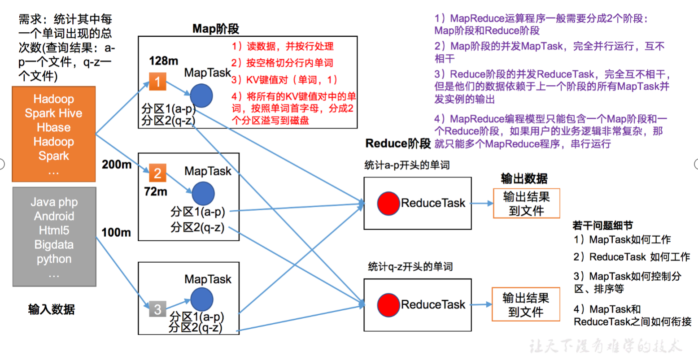
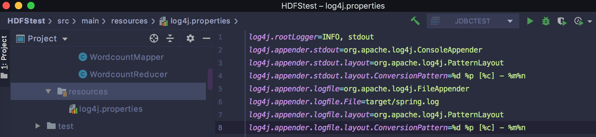
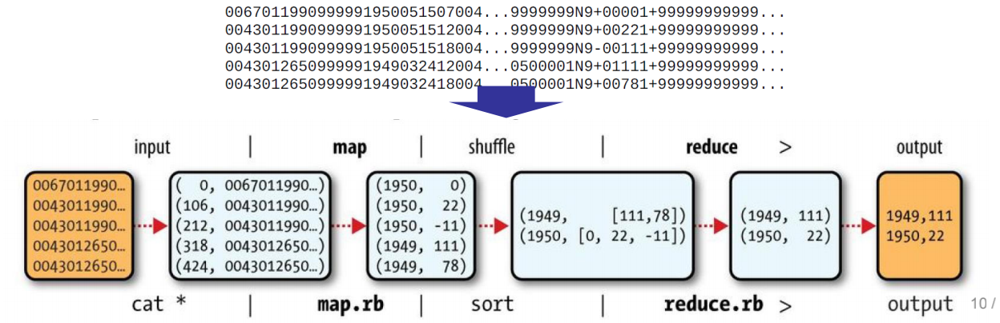
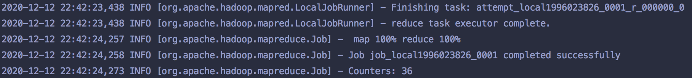
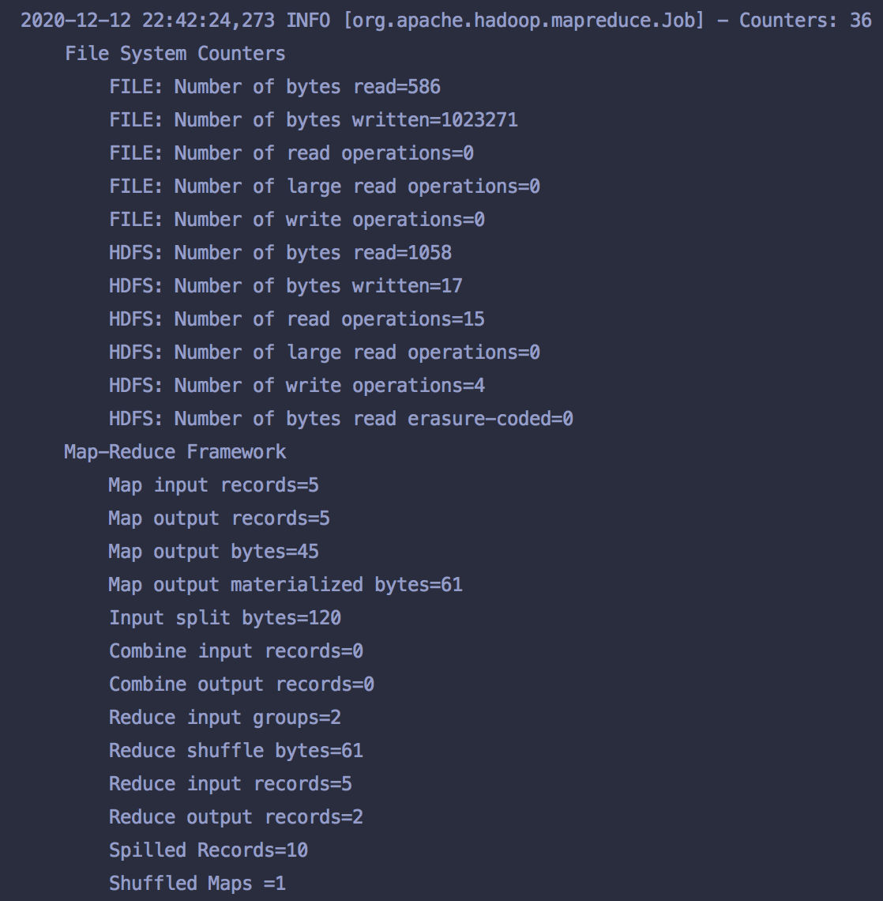
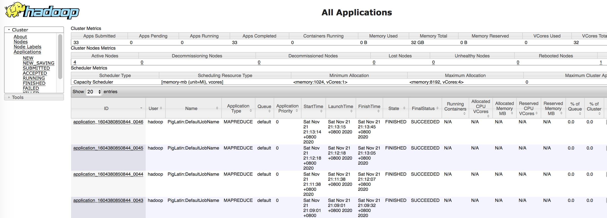

#第1章 MapReduce概述
##1.1 MapReduce定义
```
  MapReduce是一个分布式运算程序的编程框架，是用户开发"基于Hadoop的数据分析应用"的核心框架。
  MapReduce核心功能是将用户编写的业务逻辑代码和自带默认组件整合成一个完整的分布式运算程序，并发运行在一个hadoop集群上。
```
##1.2 MapReduce优缺点
###1.2.1 优点
```
1、MapReduce易于编程
它简单的实现一些接口，就可以完成一个分布式程序，这个分布式程序可以分布到大量廉价的PC机器上运行。也就是说你写一个分布式程序，跟写一个简单的串行程序是一模一样的。就是因为这个特点使得MapReduce编程变得非常流行。

2、良好的扩展性
当你的计算资源不能得到满足的时候，你可以通过简单地增加机器来扩展它的计算能力。

3、高容错性
MapReduce设计的初衷就是使程序能够部署在廉价的PC机器上，这就要求它具有很高的容错性。比如其中一台机器挂掉了，它可以把上面的计算任务转移到另外一个节点上运行，不至于这个任务运行失败，而且这个过程不需要人工参与，而完全是由Hadoop内部完成的。    

4、适合PB级以上海量数据的离线处理
可以实现上千台服务器集群并发工作，提供数据处理能力。
```
###1.2.2 缺点
```
1、不擅长实时计算
MapReduce无法像MySQL一样，在毫秒或者秒级内返回结果。

2、不擅长流式计算
流式计算的输入数据是动态的，而MapReduce的输入数据集是静态的，不能动态变化。这是因为MapReduce自身的设计特点决定了数据源必须是静态的。

3、不擅长DAG（有向图）计算
多个应用程序存在依赖关系，后一个应用程序的输入为前一个的输出。在这种情况下，MapReduce并不是不能做，而是使用后，每个MapReduce作业的输出结果都会写入到磁盘，会造成大量的磁盘IO,导致性能非常的低下。
```
##1.3 MapReduce核心思想
MapReduce核心编程思想，如图所示。


```
(1）分布式的运算程序往往需要分成至少2个阶段。
(2）第一个阶段的MapTask并发实例，完全并行运行，互不相干。
(3）第二个阶段的ReduceTask并发实例互不相干，但是他们的数据依赖于上一个阶段的所有MapTask并发实例的输出。
(4）MapReduce编程模型只能包含一个Map阶段和一个Reduce阶段，如果用户的业务逻辑非常复杂，那就只能多个MapReduce程序，串行运行。
总结：分析WordCount数据流走向深入理解MapReduce核心思想。
```
##1.4 MapReduce进程
```
一个完整的MapReduce程序在分布式运行时有三类实例进程：
(1)MrAppMaster:负责整个程序的过程调度及状态协调。
(2)MapTask:负责Map阶段的整个数据处理流程。
(3)ReduceTask:负责Reduce阶段的整个数据处理流程。
```
##1.5 官方WordCount源码
采用反编译工具反编译源码，发现WordCount案例有Map类、Reduce类和驱动类。且数据的类型是Hadoop自身封装的序列化类型。
##1.6 常用数据序列化类型
表 常用的数据类型对应的Hadoop数据序列化类型

|Java类型|	Hadoop Writable类型|
|--------| -----              |
|boolean|	BooleanWritable|
|byte|	ByteWritable|
|int|	IntWritable|
|float|	FloatWritable|
|long|	LongWritable|
|double|	DoubleWritable|
|String|	Text|
|map|	MapWritable|
|array|	ArrayWritable|
##1.7 MapReduce编程规范
用户编写的程序分成三个部分：Mapper、Reducer和Driver。
```
1、Mapper阶段
（1）用户自定义的Mapper要继承自己的父类
（2）Mapper的输入数据是KV对的形式（KV的类型可自定义）
（3）Mapper中的业务逻辑写在map( )方法中
（4）Mapper的输出数据是KV对的形式（KV的类型可自定义）
（5）map（ ）方法（MapTask进程）对每一个<K,V>调用一次
2、Reduce阶段
（1）用户自定义的Reducer要继承自己的父类
（2）Reducer的输入数据类型对应的Mapper的输出数据类型，也是KV
（3）Reducer的业务逻辑写在reduce（ ）方法中
（4）ReduceTask进程对每一组相同k的<k,v>组调用一次reduce（ ）方法
3、Driver阶段
相当于YARN集群的客户端，用于提交我们整个程序到YARN集群，提交的是封装了MapReduce程序相关运行参数的job对象
```
##1.8 WordCount案例实操
###1．需求
```

在给定的文本文件中统计输出每一个单词出现的总次数
（1）输入数据
hello.txt
（2）期望输出数据
xiaoming	xiaoming
lilei	lilei
hanmeimei	hanmeimei
jiao
banzhang
xue
hadoop
```
###2．需求分析
```

按照MapReduce编程规范，分别编写Mapper，Reducer，Driver;

（1）输入数据
xiaoming	xiaoming
lilei	lilei
hanmeimei	hanmeimei
jiao
banzhang
xue
hadoop

（2）Mapper
a、将MapTask传给我们的文本内容先转换成String
xiaoming    xiaoming

b、根据空格将这一行切分成单词
xiaoming
xiaoming

c、将单词输出为<单词，1>
xiaoming，1
xiaoming，1

（3）Reducer
a、汇总各个key的个数
xiaoming，1
xiaoming，1

b、输出该key的总次数
xiaoming，2

（4）Driver
a、获取配置信息，获取job对象实例
b、指定本程序的jar包所在的本地路劲
c、关联Mapper、Reducer业务类
d、指定Mapper输出数据的kv类型
e、指定最终输出的数据的kv类型
f、指定job的输入原始文件所在目录
g、指定job的输出结果所在目录
h、提交作业

（5）输出数据

```
###3.环境准备
```
（1）创建maven工程
```


```
(2)在项目的src/main/resources目录下，新建一个文件，命名为“log4j.properties”

```

文件中填入
```shell
log4j.rootLogger=INFO, stdout
log4j.appender.stdout=org.apache.log4j.ConsoleAppender
log4j.appender.stdout.layout=org.apache.log4j.PatternLayout
log4j.appender.stdout.layout.ConversionPattern=%d %p [%c] - %m%n
log4j.appender.logfile=org.apache.log4j.FileAppender
log4j.appender.logfile.File=target/spring.log
log4j.appender.logfile.layout=org.apache.log4j.PatternLayout
log4j.appender.logfile.layout.ConversionPattern=%d %p [%c] - %m%n
```


###4.编写程序
####（1）编写Mapper类
```shell
package com.test.hadoop;
import java.io.IOException;
import org.apache.hadoop.io.IntWritable;
import org.apache.hadoop.io.LongWritable;
import org.apache.hadoop.io.Text;
import org.apache.hadoop.mapreduce.Mapper;

    public class WordcountMapper extends Mapper<LongWritable, Text, Text, IntWritable>{

        Text k = new Text();
        IntWritable v = new IntWritable(1);

        @Override
        protected void map(LongWritable key, Text value, Context context)	throws IOException, InterruptedException {

            // 1 获取一行
            String line = value.toString();

            // 2 切割
            String[] words = line.split(" ");

            // 3 输出
            for (String word : words) {

                k.set(word);
                context.write(k, v);
            }
        }
}


```
####（2）编写Reducer类
```shell
package com.test.hadoop;
import java.io.IOException;
import org.apache.hadoop.io.IntWritable;
import org.apache.hadoop.io.Text;
import org.apache.hadoop.mapreduce.Reducer;

public class WordcountReducer extends Reducer<Text, IntWritable, Text, IntWritable>{
    int sum;
    IntWritable v = new IntWritable();

    @Override
    protected void reduce(Text key, Iterable<IntWritable> values,Context context) throws IOException, InterruptedException {

        // 1 累加求和
        sum = 0;
        for (IntWritable count : values) {
            sum += count.get();
        }

        // 2 输出
        v.set(sum);
        context.write(key,v);
    }
}

```
#### （3）编写Driver驱动类
```shell
package com.test.hadoop;


import java.io.IOException;
import org.apache.hadoop.conf.Configuration;
import org.apache.hadoop.fs.Path;
import org.apache.hadoop.io.IntWritable;
import org.apache.hadoop.io.Text;
import org.apache.hadoop.mapreduce.Job;
import org.apache.hadoop.mapreduce.lib.input.FileInputFormat;
import org.apache.hadoop.mapreduce.lib.output.FileOutputFormat;

    public class WordcountDriver {

        public static void main(String[] args) throws IOException, ClassNotFoundException, InterruptedException {

            // 1 获取配置信息以及封装任务
            Configuration configuration = new Configuration();
            Job job = Job.getInstance(configuration);

            // 2 设置jar加载路径
            job.setJarByClass(WordcountDriver.class);

            // 3 设置map和reduce类
            job.setMapperClass(WordcountMapper.class);
            job.setReducerClass(WordcountReducer.class);

            // 4 设置map输出
            job.setMapOutputKeyClass(Text.class);
            job.setMapOutputValueClass(IntWritable.class);

            // 5 设置最终输出kv类型
            job.setOutputKeyClass(Text.class);
            job.setOutputValueClass(IntWritable.class);

            // 6 设置输入和输出路径
            String inpath ="hdfs://10.211.55.6:9000/test/hello.txt";
            String outpath ="hdfs://10.211.55.6:9000/output3";
           
           
                       FileInputFormat.setInputPaths(job, new Path(inpath));
                       FileOutputFormat.setOutputPath(job, new Path(outpath));


            // 7 提交
            boolean result = job.waitForCompletion(true);

            System.exit(result ? 0 : 1);
        }
    }

```
###查看结果


##1.9 编写应用程序

```
MapReduce将处理分为两个阶段：map阶段和reduce阶段。
每个相位都有键值对作为输入和输出，其类型可以由程序员选择。
程序员还指定了两个函数：map函数和reduce函数。
```

###Writing an Application – Mapper
```shell
package com.hadoop.hdfs.api;

import java.io.IOException;

import org.apache.hadoop.classification.InterfaceAudience.Private;
import org.apache.hadoop.io.IntWritable;
import org.apache.hadoop.io.LongWritable;
import org.apache.hadoop.io.Text;
import org.apache.hadoop.mapreduce.Mapper;

import com.codahale.metrics.Timer.Context;

public class MaxTemperatureMapper
	extends Mapper<LongWritable, Text, Text, IntWritable>{
	
		
	private static final int MISSING = 9999;
	
	@Override
	public void map(LongWritable key, Text value, Context context)
		throws IOException, InterruptedException{
		
		String line = value.toString();
		String year = line.substring(15, 19);
		int airTemperature;
		if (line.charAt(87) =='+') {
			airTemperature = Integer.parseInt(line.substring(88, 92));
		}else {
			airTemperature =Integer.parseInt(line.substring(87, 92));
		}
		String quality = line.substring(92, 93);
		if (airTemperature != MISSING && quality.matches("[01459]")) {
			context.write(new Text(year), new IntWritable(airTemperature));
			
		}
	
	
	}
}

```
###Writing an Application – Reducer
```shell
package com.hadoop.hdfs.api;

import java.io.IOException;

import org.apache.hadoop.io.IntWritable;
import org.apache.hadoop.io.Text;
import org.apache.hadoop.mapreduce.Reducer;

public class MaxTemperatureReducer 
	extends Reducer<Text, IntWritable, Text, IntWritable> {
	
	@Override
	public void reduce(Text key, Iterable<IntWritable> values, Context context)
		throws IOException, InterruptedException {
		
		int maxValue = Integer.MIN_VALUE;
		for (IntWritable value : values) {
			maxValue = Math.max(maxValue, value.get());
		}  
		context.write(key, new IntWritable(maxValue));
		
		}
		
		
	}

```
###Writing an Application – Job
```shell
package com.hadoop.hdfs.api;

import org.apache.hadoop.fs.Path;
import org.apache.hadoop.io.IntWritable;
import org.apache.hadoop.io.Text;
import org.apache.hadoop.mapreduce.Job;
import org.apache.hadoop.mapreduce.lib.input.FileInputFormat;
import org.apache.hadoop.mapreduce.lib.output.FileOutputFormat;

public class MaxTemperature {
 public static void main(String[] args) throws Exception {
//	if (args.length !=2) {
//		 System.err.println("Usage: MaxTemperature<input path><output path>");
//		 System.exit(-1);
//		 
//	 }
	
	 System.setProperty("HADOOP_USER_NAME", "hadoop");
	 
	Job job = new Job();
	 job.setJarByClass(MaxTemperature.class);
	 job.setJobName("Max temperature");
	 
	    String inpath ="hdfs://10.211.55.6:9000/wordcount/input/test/sample.txt";
		String outpath ="hdfs://10.211.55.6:9000/output";		
		
	 FileInputFormat.addInputPath(job, new Path(inpath));
	 FileOutputFormat.setOutputPath(job, new Path(outpath));
	 
	 job.setMapperClass(MaxTemperatureMapper.class);
	 job.setReducerClass(MaxTemperatureReducer.class);
	 
	 job.setOutputKeyClass(Text.class);
	 job.setOutputValueClass(IntWritable.class);
	 
	 System.exit(job.waitForCompletion(true)? 0 : 1 );
	  }
}


```
###在群集上运行
####包装
#####将程序打包为JAR文件以发送到集群
#####使用Ant方便

####启动job
#####使用-conf选项运行驱动程序以指定集群

####输出包括更多有用的信息

###The MapReduce Web UI
####用于查找作业的进度、统计信息和日志
####http://resource-manager-host:8088/

###检索结果
####每个reducer产生一个输出文件
#####e.g., part-00000 … part-00029
###检索结果
