##Step1. git clone 下載 mininet
先安裝 git
```shell
$sudo apt install git
```
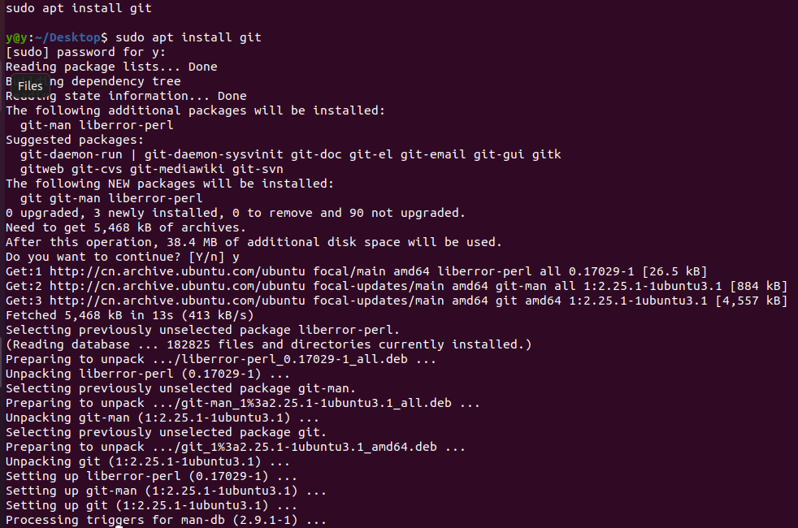`
下载最新版本的mininet 
```shell
$ git clone git://github.com/mininet/mininet.git 
```
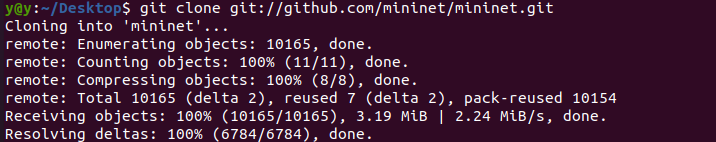
##Step2. 安裝 mininet
-a 全部安裝
-h 可列出所有可用選項
-s mydir 可指定安裝資料夾，需放在所有選項的最前面
###Step2.1先安装OpenVSwitch交换机
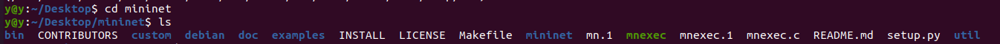
1.切入root用户
```shell
$ sudo su
```
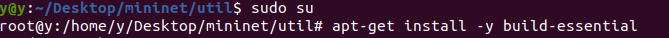
2.安装系统组件及库文件以作为OVS正确运行的环境依赖
```shell
apt-get install -y build-essential
```
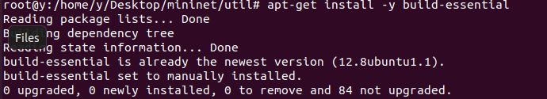
```shell
apt-get install libssl-dev
```

```shell
apt-get install libcap-ng-dev
```
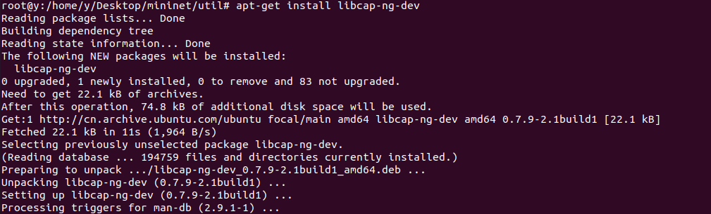
```shell
apt-get install autoconf
```
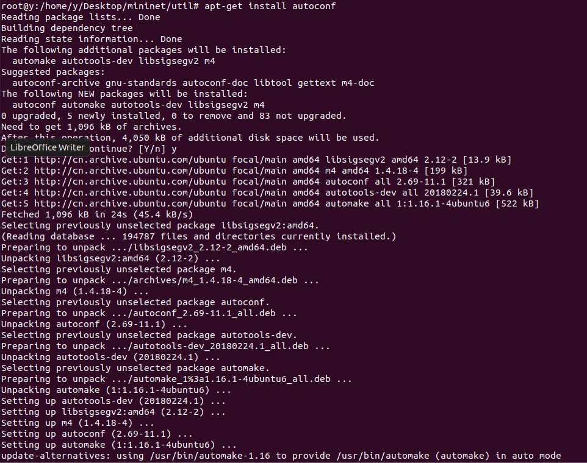
```shell
apt-get install automake
```
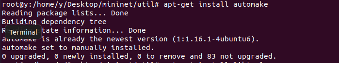
```shell
apt-get install libtool
```
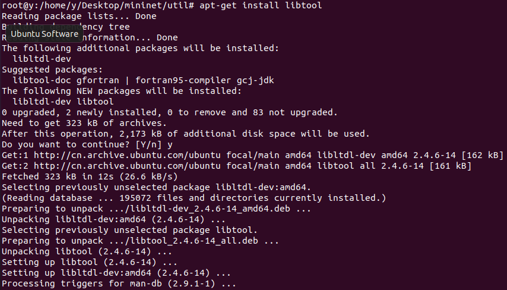
3.下载并解压OVS 2.3.0安装包（还可以下载其他安装包，如OVS 2.7.0安装包）
```shell
wget http://openvswitch.org/releases/openvswitch-2.3.0.tar.gz
```
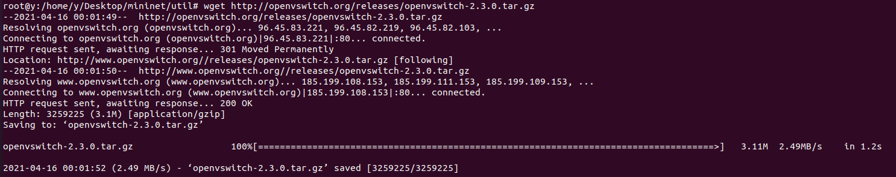
```shell
tar -xzvf openvswitch-2.3.0.tar.gz
```
4.构建基于Linux内核的交换机
```shell
cd openvswitch-2.3.0
 ./boot.sh  #生成配置文件
```
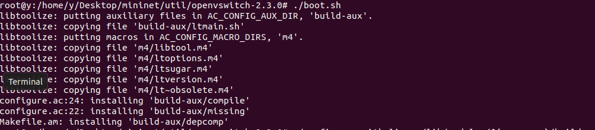
```
./configure -with-linux=/lib/modules/$(uname -r)/build #配置
```
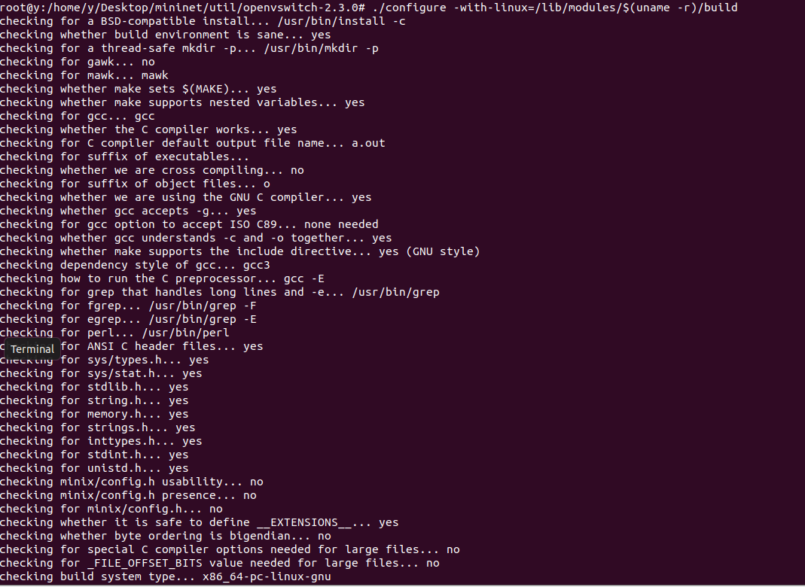
```shell
./configure
```

5.编译并安装OVS
```shell
make clean
make && make install
```
6.使用ovsdb工具初始化配置数据库
```shell
mkdir -p /usr/local/etc/openvswitch
ovsdb-tool create /usr/local/etc/openvswitch/conf.db vswitchd/vswitch.ovsschema  2>/dev/null
```
7.  启动ovsdb-server配置数据库
```
apt install openvswitch-common
ovsdb-server -v --remote=punix:/usr/local/var/run/openvswitch/db.sock --remote=db:Open_vSwitch,Open_vSwitch,manager_options --private-key=db:Open_vSwitch,SSL,private_key --certificate=db:Open_vSwitch,SSL,certificate --bootstrap-ca-cert=db:Open_vSwitch,SSL,ca_cert --pidfile --detach
```
8.首次用ovsdb-tool创建数据库时需用ovs-vsctl命令初始化下数据库
```shell
ovs-vsctl --no-wait init
```
9.启动OVS主进程
```shell
ovs-vswitchd --pidfile --detach
```
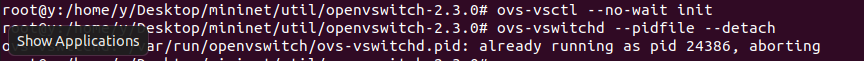
10.如下命令查看所安装OVS的版本号
```shell
ovs-vsctl --version
```
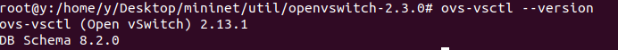
编写OVS启动脚本
OpenVSwitch每次启动都需要输入一堆命令，建议写一个启动脚本
```shell
apt install vim 
vim start-ovs.sh
```
1.添加内容如下：
```shell

ovsdb-server -v --remote=punix:/usr/local/var/run/openvswitch/db.sock --remote=db:Open_vSwitch,Open_vSwitch,manager_options --private-key=db:Open_vSwitch,SSL,private_key --certificate=db:Open_vSwitch,SSL,certificate --bootstrap-ca-cert=db:Open_vSwitch,SSL,ca_cert --pidfile --detach
ovs-vsctl --no-wait init
ovs-vswitchd --pidfile --detach
```
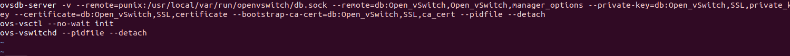
2.启动OVS
```shell
sh start-ovs.sh
```
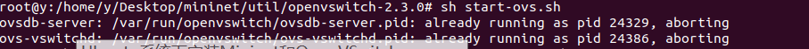

Step3. 測試 Mininet
```shell
Apt install mininet
$ sudo mn --test pingall
```
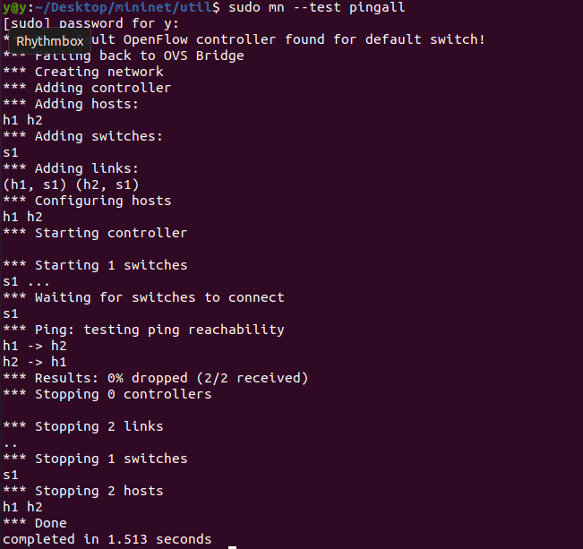
```shell
$ mininet/util/install.sh -n3V 2.5.0
```
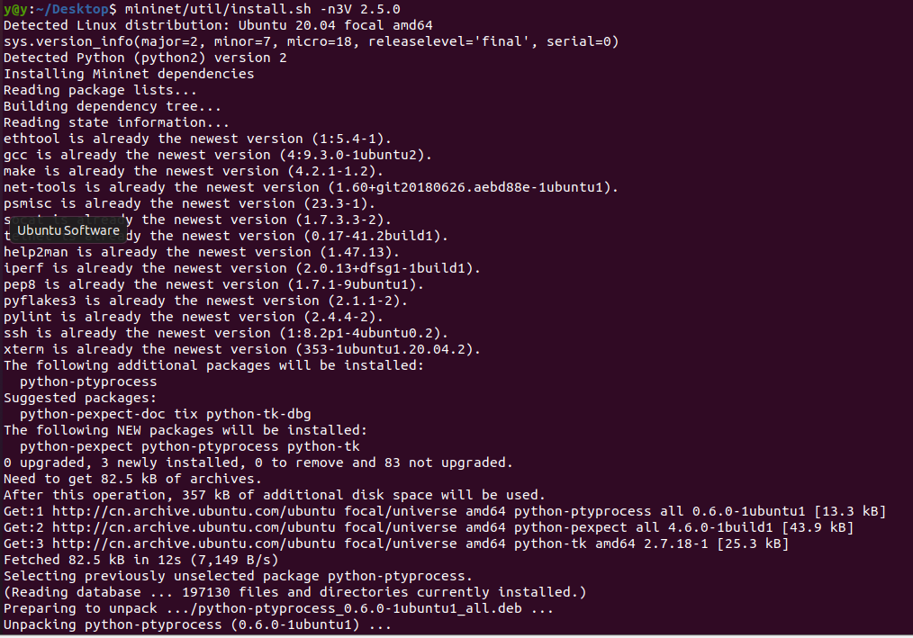

