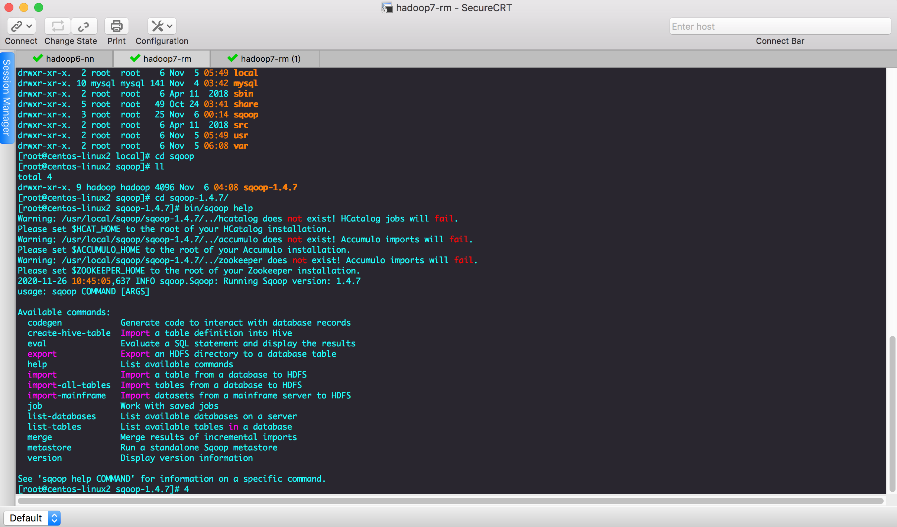
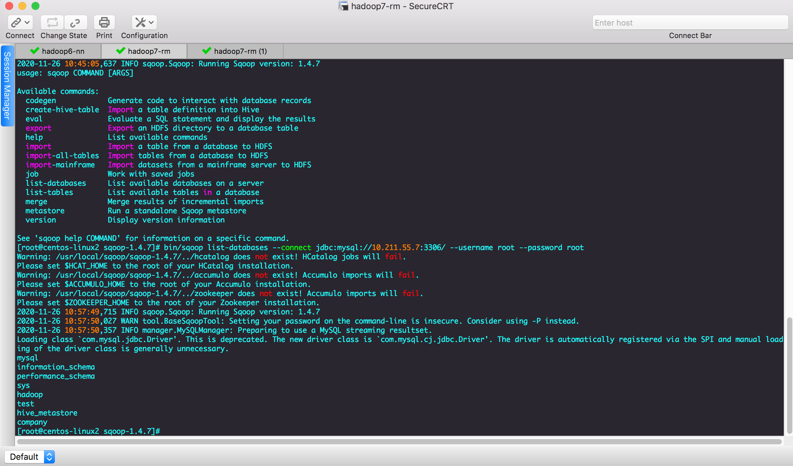
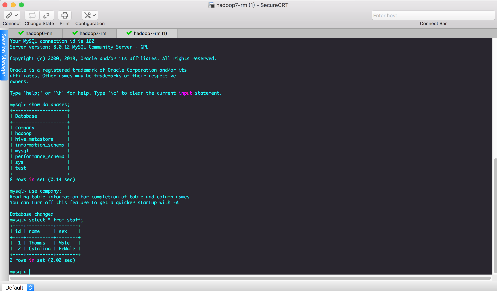
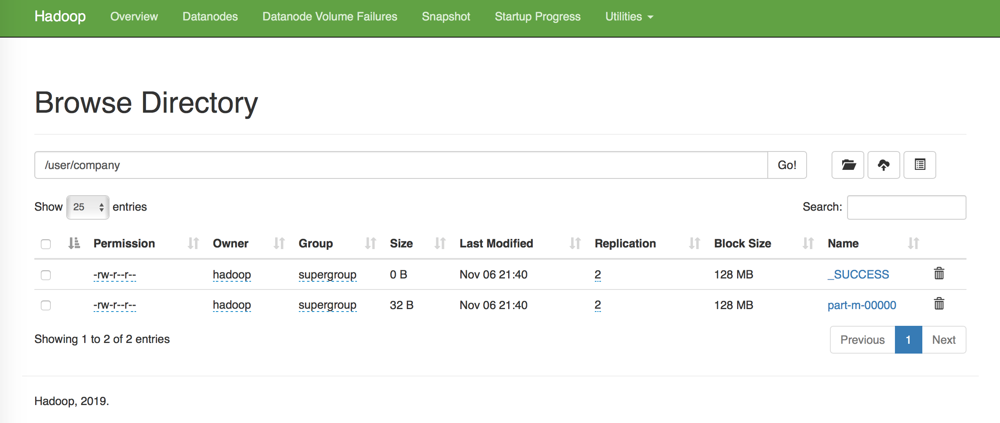
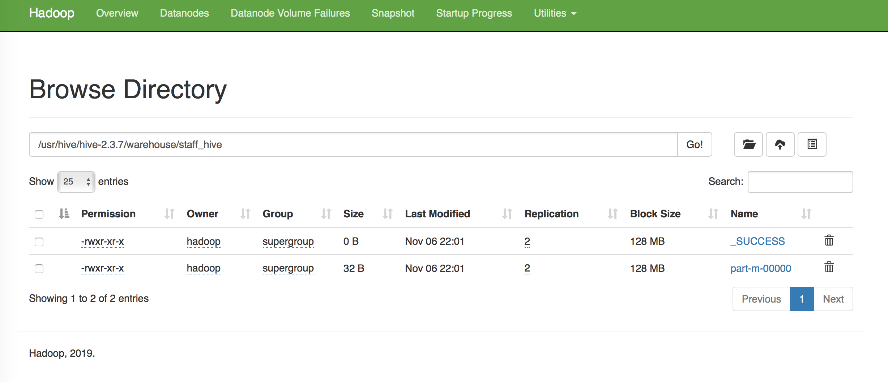
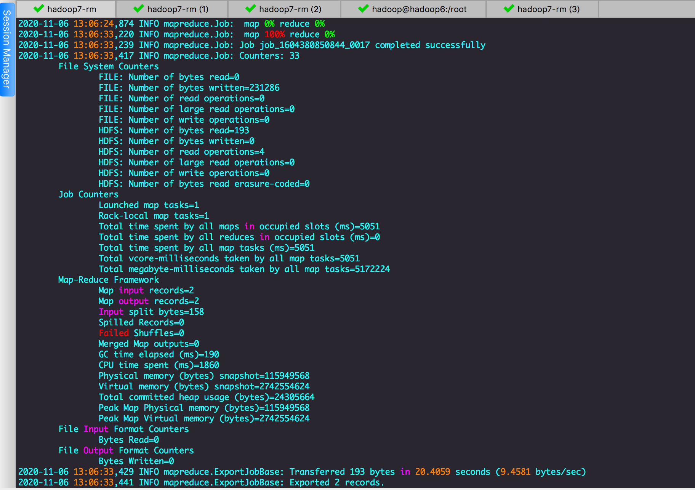
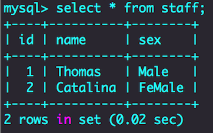

#第1章 Sqoop简介
Sqoop是一款开源的工具，主要用于在Hadoop(Hive)与传统的数据库(mysql、postgresql...)间进行数据的传递，可以将一个关系型数据库（例如 ： MySQL ,Oracle ,Postgres等）中的数据导进到Hadoop的HDFS中，也可以将HDFS的数据导进到关系型数据库中。

Sqoop项目开始于2009年，最早是作为Hadoop的一个第三方模块存在，后来为了让使用者能够快速部署，也为了让开发人员能够更快速的迭代开发，Sqoop独立成为一个Apache项目。
Sqoop2的最新版本是1.99.7。请注意，2与1不兼容，且特征不完整，它并不打算用于生产部署。
最后权衡之后我们选用sqoop-1.4.7。
#第2章 Sqoop原理
    将导入或导出命令翻译成mapreduce程序来实现。
    在翻译出的mapreduce中主要是对inputformat和outputformat进行定制。
#第3章 Sqoop安装
    安装Sqoop的前提是已经具备Java和Hadoop的环境。
##第一步：解压和重命名文件
```shell
# mkdir /usr/local/sqoop
# tar -zxvf sqoop-1.4.7.bin__hadoop-2.6.0.tar.gz -C /usr/local/sqoop
# cd /usr/local/sqoop
# mv sqoop-1.4.7.bin__hadoop-2.6.0  sqoop-1.4.7
```
##第二步：进入sqoop的配置目录
```shell
# cd /usr/local/sqoop/sqoop-1.4.7/conf/
//将sqoop-env-template.sh复制一份并命名为sqoop-env.sh
# cp sqoop-env-template.sh sqoop-env.sh
```
##第三步：编辑sqoop-env.sh 加入安装了组件的对应路径
```shell
# vim sqoop-env.sh

#Set path to where bin/hadoop is available
export HADOOP_COMMON_HOME=/usr/local/hadoop/hadoop-3.2.0
#Set path to where hadoop-*-core.jar is available
export HADOOP_MAPRED_HOME=/usr/local/hadoop/hadoop-3.2.0
#set the path to where bin/hbase is available
export HBASE_HOME=/usr/local/hadoop/hbase_2.2.6
#Set the path to where bin/hive is available
export HIVE_HOME=/usr/local/hive/hive-2.3.7

```
##第四步：配置环境变量
```shell
# vim /etc/profile
 
# sqoop config
export SQOOP_HOME=/usr/local/sqoop/sqoop-1.4.7
export PATH=$PATH:$SQOOP_HOME/bin

//刷新配置文件
# source /etc/profile
```
##第五步：拷贝JDBC驱动
```shell
//拷贝mysql-connector-java-8.0.16.tar.gz 到lib目录下
$ cp mysql-connector-java-8.0.16.tar.gz /usr/local/sqoop/sqoop-1.4.7/lib

//验证sqoop
$ bin/sqoop help 
```


##第六步：测试连接MySQL
```shell
# bin/sqoop list-databases --connect jdbc:mysql://10.211.55.7:3306/ --username root --password root 
```


#Sqoop报错
###Sqoop连接数据库报错
找不到org/apache/commons/lang/StringUtils
解决方法：
在apache 上下载commons-lang-2.6.jar包并上传到lib下即可，下载地址：
http://mirrors.tuna.tsinghua.edu.cn/apache//commons/lang/binaries/commons-lang-2.6-bin.zip

#第4章 Sqoop的简单使用案例
##4.1 导入数据
在Sqoop中，“导入”概念指：从非大数据集群（RDBMS）向大数据集群（HDFS，HIVE，HBASE）中传输数据，叫做：导入，即使用import关键字。
###4.1.1 RDBMS到HDFS
####(1) 确定Mysql服务开启正常
####(2) 在Mysql中新建一张表并插入一些数据
```shell
$ mysql -uroot -p
Enter password:root
mysql> create database company;
mysql> create table company.staff(id int(4) primary key not null auto_increment, name varchar(255), sex varchar(255));
mysql> insert into company.staff(name, sex) values('Thomas', 'Male');
mysql> insert into company.staff(name, sex) values('Catalina', 'FeMale');
```

####(3) 导入数据
#####全部导入
```shell
$ bin/sqoop import \
--connect jdbc:mysql://10.211.55.7:3306/company \
--username root \
--password root \
--table staff \
--target-dir /user/company \
--delete-target-dir \
--num-mappers 1 \
--fields-terminated-by "\t"
```
http://10.211.55.6:50070/explorer.html#/user/company
可以看到结果part-m-00000

###4.1.2 RDBMS到Hive
```shell
$ bin/sqoop import \
--connect jdbc:mysql://10.211.55.7:3306/company \
--username root \
--password root \
--table staff \
--num-mappers 1 \
--hive-import \
--fields-terminated-by "\t" \
--hive-overwrite \
--hive-table staff_hive
//提示：该过程分为两步，第一步将数据导入到HDFS，第二步将导入到HDFS的数据迁移到Hive仓库
```
http://10.211.55.6:50070/explorer.html#/usr/hive/hive-2.3.7/warehouse/staff_hive
可以看到结果part-m-00000


##4.2、导出数据
在Sqoop中，“导出”概念指：从大数据集群（HDFS，HIVE，HBASE）向非大数据集群（RDBMS）中传输数据，叫做：导出，即使用export关键字。
###4.2.1 HIVE/HDFS到RDBMS
```shell
//先在mysql清空表数据
mysql> select * from staff;
mysql> truncate table staff;
mysql> select * from staff;
Empty set (0.00 sec) 

$ bin/sqoop export \
--connect jdbc:mysql://10.211.55.7:3306/company \
--username root \
--password root \
--table staff \
--num-mappers 1 \
--export-dir /usr/hive/hive-2.3.7/warehouse/staff_hive \
--input-fields-terminated-by "\t"
```
运行结束




完成
